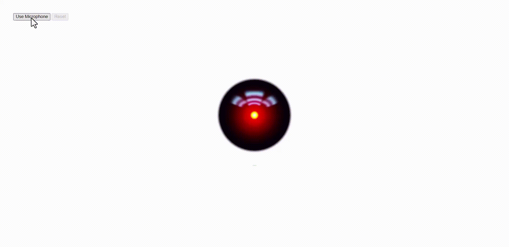

# Circular Audio Wave


## Introduction
A application that visualizes the sound on `Hal9000` as a circular wave.

* This app works only on browsers that supports Web Audio API.

## Installation

```
1. git clone https://github.com/yusufEk1n/HAL9000-Circular-Audio-Wave
```

```
2. cd HAL9000-Circular-Audio-Wave
```

```
3. open index.html
```